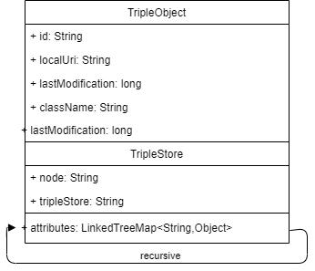
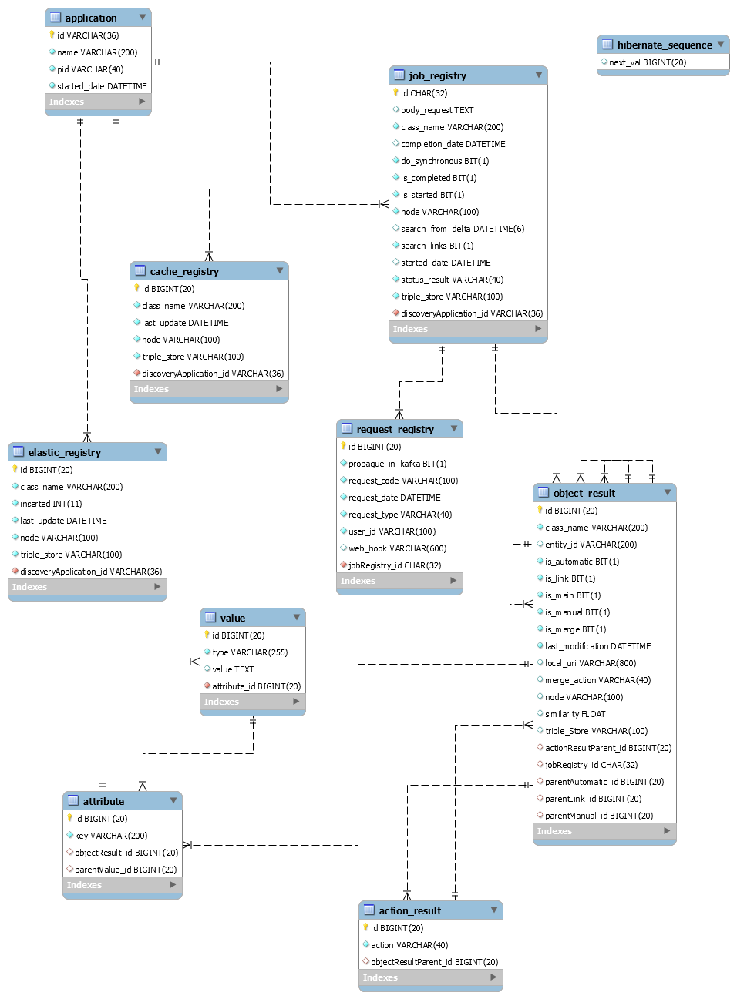
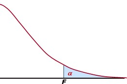
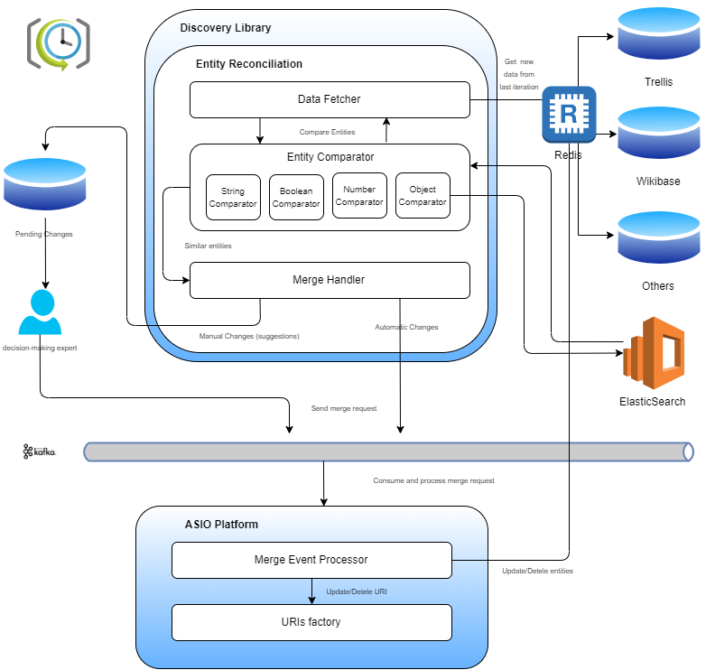
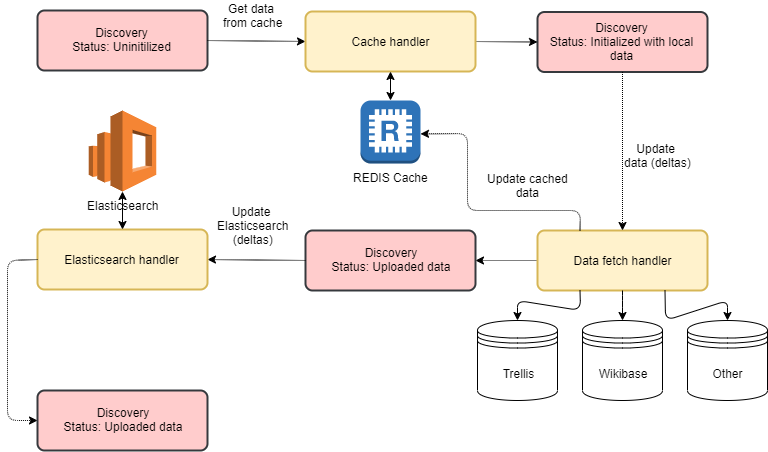
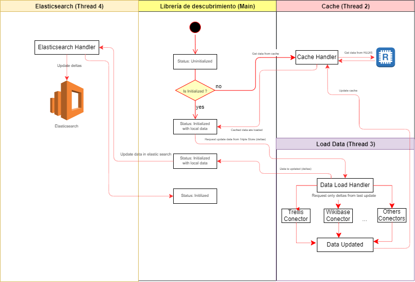

# Documentación técnica para la Librería de descubrimiento 

| Entregable     | Documentación de la librería de descubrimiento               |
| -------------- | ------------------------------------------------------------ |
| Fecha          | 28/04/2021                                                   |
| Revisado por   | Daniel Ruiz Santamaría                                       |
| Proyecto       | [ASIO](https://www.um.es/web/hercules/proyectos/asio) (Arquitectura Semántica e Infraestructura Ontológica) en el marco de la iniciativa [Hércules](https://www.um.es/web/hercules/) para la Semántica de Datos de Investigación de Universidades que forma parte de [CRUE-TIC](https://www.crue.org/proyecto/hercules/) |
| Módulo         | Discovery                                                    |
| Tipo           | Software                                                     |
| Objetivo       | Librería de descubrimiento para el proyecto Backend SGI (ASIO). |
| Estado         | Completado                                                   |
| Próximos pasos | -                                                            |
| Documentación  | [Librería de descubrimiento](https://github.com/HerculesCRUE/ib-asio-docs-/tree/master/24-Librer%C3%ADa_de_descubrimiento)<br/>[Manual de usuario](./manual_de_usuario.md) (documentación de alto nivel)<br />[Documentación API REST de la librería de descubrimiento](./documentacion_api_rest_de_la_libreria_de_descubrimiento.md) (documentación de bajo nivel)<br/>[README](../README.md)<br/>[docker](./docker.md)<br/>[Federación](https://github.com/HerculesCRUE/ib-federation)<br/>[Service Discovery](https://github.com/HerculesCRUE/ib-service-discovery) |


## Despliegue

Se puede encontrar documentación exhaustiva de desplieguen en el documento [build](./build.md) tanto para usuarios finales como para desarrolladores.

### Requisitos

* OpenJDK 11
* Maven 3.6.x
* Docker

### Compilación

Para realizar la compilación se ejecutará el siguiente comando:

```bash
mvn clean package
```

También sería posible instalar o desplegar los artefactos sustituyendo `package` por `install` o `deploy` respectivamente.

Los artefactos se generarán dentro del directorio `target` de cada uno de los módulos:

#### Módulo Back

Módulo que añade una capa de servicios REST a la funcionalidad de la aplicación.

Los artefactos se encuentran dentro de discovery-back/target

* Artefacto: discovery-back-{version}.jar

#### Módulo Service

Módulo que contiene la lógica de la aplicación. Puede ser utilizado como librería independiente para ser integrado en otras aplicaciones

* Los artefactos se encuentran dentro de discovery-service/target

  * Artefacto: discovery-service-{version}.jar

#### Módulo jpa-abstractions

Módulo con utilidades para el acceso a datos mediante JPA.

#### Módulo service-abstractions

Módulo con utilidades para la generación de servicios.

#### Módulo swagger

Módulo que contiene la funcionalidad necesaria para añadir [Swagger](https://swagger.io/) para la interacción con el API Rest.

#### Módulo audit

Módulo que contiene la funcionalidad necesaria para la generación de datos de auditoría para las tablas de base de datos.

### Ejecución

Al generarse un JAR bootable la ejecución se realizará mediante el siguiente comando:

```bash
java -jar {jar-name}.jar
```

Sustituyendo `{jar-name}` por el nombre del fichero JAR generado.

No es necesario especificar la clase de inicio de la aplicación, ya que el fichero MANIFEST.MF generado ya contiene la información necesaria. Solamente se especificarán los parámetros necesarios.

### Ejecución de test

Los test de integración pueden ejecutarse con el siguiente comando

```bash
mvn clean verify
```

Esto generara reportes sobre el resultado de dichos test, disponibles en la ruta 

```
./target/surefire-reports
```

### Modelo de datos

Dado que la librería de descubrimiento interactúa con múltiples herramientas tales como Redis, Elasticsearch, Trellis, Wikibase, ...etc, esta dispone de varios modelos de datos según el propósito. La conversión entre los distintas entidades de distintos tipos de datos, siempre es posible, y esta implementada en cada uno de los POJOs que los modelan.

#### Modelo de datos General

Este modelo de datos general

Este modelo de datos, es el principal de la aplicación.

Intenta modelar de forma generalista, cualquier tipo de entidad, siempre y cuando esta pueda ser descrita en formato Json.

Este modelo de datos, se implementa por medio de la clase TripleObject que modela cualquier tipo de entidad, que pueda ser obtenida de cualquier Triple Store.

Básicamente, podemos dividir los atributos de la entidad, en dos tipos principales:

* **Metadatos:** Datos en los cuales almacenamos información de carácter general, como por ejemplo:
  * **id:** Identificador de la instancia, obtenido en el momento de recuperar la información del Triple Store
  * **localURI:** Uri por la cual la instancia puede ser recuperado a través del servidor ldp.
  * **className:** clase o entidad a la que pertenece, por ejemplo Universidad, Persona....
  * **lastModification:** Fecha a partir de la cual, se realizo la última modificación en el Triple Store. Esta fecha es básica para:
    * Mantener la última versión en la cache, es decir, poder actualizar el objeto en cache y en memoria, cuando este cambie en el triple store.
    * Evaluar similitudes entre entidades solo para aquellas entidades que hayan cambiado desde la última evaluación
  * **tripleStore:** Información relativa al triple store del cual se obtuvo la entidad. A parte de otros campos de menor importancia, los campos vitales son:
    * **nodo:** Nodo del Backend SGI con el cual esta relacionada la instancia.
    * **tripleStore:** Sistema de almacenamiento del cual se obtuvo la instancia.
* **Atributos:**  Aquí se modelan con una estructura genérica  ( LinkedTreeMap<String,Object> ), pero conocida (lo cual permitirá su posterior explotación), los atributos asociados a una determinada estancia presentes en el Triple Store. Estos atributos pueden ser:
  * **Primitivos:** Cualquier tipo de datos primitivo, como por ejemplo:
    * Enteros
    * Decimales
    * Booleanos
    * Cadenas de texto
    * Fechas
  * **Objetos:** Lo que permite almacenar objetos anidados, que a su vez se modelan con la misma estructura que los atributos, es decir mediante un ( LinkedTreeMap<String,Object> ).
  * **Listas:** Que pueden ser a su vez listas de:
    * Primitivos
    * Objetos
    * Ambos




En definitiva, se ha buscado un modelo de datos, predecible, pero con la flexibilidad necesaria para poder almacenar cualquier tipo de información relativa a un objeto que podamos encontrar en cualquier Triple Store. 

Un ejemplo de una instancia almacenada en este tipo de modelo podría ser  por ejemplo para un Articulo:

```json
{
  "id" : "b38cefb6-fea2-37c7-9f5e-6b9e0060a178",
  "localURI" : "http://herc-iz-front-desa.atica.um.es/Articulo/b38cefb6-fea2-37c7-9f5e-6b9e0060a178",
  "className" : "Articulo",
  "lastModification" : 1607511132000,
  "tripleStore" : {
      "tripleStore" : "trellis",
      "node" : {
        "node" : "um"
      },
      "baseURL" : "http://herc-iz-front-desa.atica.um.es/"
    },
    "attributes" : {
      "año" : "2006",
      "coautoria" : "N",
      "id" : "36502",
      "name" : "LA PROMOCIÓN A LA LECTURA: UNA CUESTIÓN DIDÁCTICA DE PEQUEÑOS Y GRANDES PERSONAJES"
    }
  }

```

Este diseño añade una enorme flexibilidad, al modelo, pero hace mas complicada su explotación, ya que potencialmente cualquier atributo puede ser de cualquier tipo, e incluso recursivamente puede contener objetos o listas de objetos hasta cualquier nivel de anidación. Para facilitar la explotación, se crea la estructura de datos auxiliar flattenAttributes, que básicamente reduce el nivel de profundidad de la estructura a 1, construyéndola sobre un Map, donde la estructura de la Key, tendrá tantos niveles, separados por punto, como tuviese la estructura attributes. Es decir Si por ejemplo modelamos la clase Universidad, que a su vez, modela objetos de tipo Grupo de investigación que a su vez tienen Personas, la key para la entidad persona, con ese nivel de anidación seria del tipo:

```yaml
universidad.grupoInvestigacio.persona
```

La clase Triple Object a su vez implementa toda la algoritmia necesaria para:

* Crear y mantener las estructuras de datos.
* Facilitar su explotación, para su uso en otras clases.

#### Modelo de datos Elasticsearch

Se crea la clase TripleObjectES, para modelar un objeto del tipo TripleObject, almacenado en ElasticSearch.

Básicamente es el mismo objeto, pero modelado de la forma que se considera optima para su almacenamiento e indexado en Elasticsearch.

La conversión entre ambos objetos, es trivial, por lo que cualquier TripleObjectES puede ser convertido en un TripleObject y viceversa.

#### Estructuras de datos en memoria.

Todos los TripleObject recuperados de los Triple Stores son almacenados en estructuras de datos optimizadas para trabajar con ellas con una complejidad de O(1), en la clase **CacheService**. Esta gestiona todos los accesos a datos, y interactúa con la cache Redis, de forma que mantiene en memoria, todo aquello que necesita, manteniendo en Redis, el resto de información de forma que sea rápida su recuperación si fuese necesario.

Las estructuras se implementan en forma de Mapas anidados siguiendo la estructura

`Nodo --> TripleStore --> ClassName --> id --> TripleObject`

De forma que como se ha comentado el acceso a cualquier dato concreto tenga una complejidad de O(1), y también el acceso a un bloque de información sea de O(1), por ejemplo, obtener todas los TripleObject, Persona, almacenados en un determinado Backend SGI, y un triple Store. 

#### Estructuras de datos en REDIS.

Como se ha comentado, todas las estructuras de datos ofrecidos por el **CacheService**, tienen su respaldo en REDIS.

Estas estructuras de almacenan en distintas keys, hasta el nivel de Clase:

`Nodo --> TripleStore --> ClassName`

Como se ha comentado el único componente que interactúa con la cache es el **CacheService**, por lo que esto es transparente para el usuario.

#### Estructuras de datos del modelo Relacional

Se usa un modelo de datos Relacional para modelar:

* **Datos de auditoria:** Como por ejemplo estado de la aplicación, que peticiones ha realizado el usuario, cuando y como y cuando se ha actualizado las caches o los datos de Elasticsearch.

*  **Datos relativos a búsqueda de similitudes en entidades:** 

  * Gestión de peticiones de búsqueda de similitudes, entre otras cosas:
    * Que petición se ha realizado
    * Que tipo de respuesta se ha solicitado (Webhook, Kakfa, Síncrona, Asíncrona...)
    * Metadatos de auditoria:
      * Fecha de petición
      * Fecha de conclusión
      * Estado de la petición
  * Respuestas a las peticiones:
    * Similitudes que generan un mergeo automático
    * Similitudes que generan un mergeo manual
    * Similitudes que generan un link entre entidades de distintos Backend SGI

* **Datos relativos a acciones en el Triple Store:** 

  * Gestión de acciones:
    * Acciones DELETE solicitadas al Event Proccesor para realizar el cambio necesario en el Triple Store.
    * Acciones UPDATE solicitadas al Event Proccesor para realizar el cambio necesario en el Triple Store.
  * Gestión de cambios:
    * Registro de cambios realizados pro el Event Proccesor.

  

El modelo de datos usado por la aplicación, se puede apreciar bajo estas líneas.



Entre las entidades destacan:

* **application:** Entidad de auditoria con datos propios de la aplicación entre ellos el pid del proceso que la ejecuta
* **cache_registry:** Datos de auditoria, sobre las actualizaciones en la cache REDIS.
* **elastic_registry:** Datos de auditoria, sobre las actualizaciones en Elasticsearch.
* **job_registry:** Entidad que modela un tipo de petición. Por cada petición distinta se creara un Job_registry. 
* **request_registry:** Entidad que modela las peticiones realizadas por el usuario. Dichas peticiones pueden ser procesadas de forma síncrona o asíncrona. En el segundo de los casos, se asegura de que si se realiza la misma petición mas de una vez (mismo Job_registry), esta solo será procesada una sola vez, y los datos serán enviados a todos los usuarios, que los solicitaron.
* **object_result:** Entidad que modela el resultado de una Job_Registry o actúa como hija de otro Object Result. Modela la parte de los metadatos descrita por la entidad TripleObject. Es una entidad recursiva, es decir las se apunta a si misma para modelar la lista de los similitudes automáticas, manuales y link con otros Backend SGI. Las entidades attribute y  value, modelan los atributos en forma de clave-valor de forma que siempre es posible la conversión entre un Object Result y a un TripleObject y viceversa.
* **attibute:** Entidad que modela la parte de el key, del clave valor.  
* **value:** Entidad que modela la parte de el valor, del clave valor.  El valor puede apuntar a un attribute, en caso de un objeto, de esta forma es posible modelar la anidación de objetos. 


### Implementación

#### Motivación

##### Problema

Es importante para comprender el diseño de la aplicación, ponerse en contexto del reto planteado. Básicamente una vez implementada la algoritmia descrita  en el documento [Librería de descubrimiento](https://github.com/HerculesCRUE/ib-asio-docs-/tree/master/24-Librer%C3%ADa_de_descubrimiento), nos encontramos ante un problema  de rendimiento (como cabria esperar).

El problema radica que para evaluar si hay duplicados dentro de una misma clase, es necesario evaluar cada uno de los elementos con el resto. Esto nos lleva a una complejidad n*(n-1), es decir del tipo cuadrática O(n^2).

Por ejemplo, para comprobar duplicados en 1000 elementos, hay que realizar 1.000^2 comprobaciones, es decir 1.000.000, y el numero crece exponencialmente con el numero de elementos.

##### Estrategias de la solución

Básicamente, se implementan dos soluciones, para mejorar sustancialmente el rendimiento:

###### Manejo de estructuras en memoria

Esto reduce la necesidad de acceso al disco (que es la principal causa de lentitud en aplicaciones, ya que su velocidad es del orden de 1000 veces inferior al acceso a memoria), y por lo tanto, un aumento significativo del rendimiento de la aplicación.

###### Reducción del espacio de búsqueda

Como se ha dejado claro, el principal problema es la complejidad implícita de comparar cada instancia con todas las demás, que como hemos dicho tiene una complejidad cuadrática  O(n^2).

Mediante el uso de Elasticsearch, podemos reducir el espacio de búsqueda. El algoritmo que sigue la aplicación para reducir dicho espacio de búsqueda implementado en la solución es el siguiente:

1. Determinar hasta cierto umbral, donde según la estrategia de Pareto, pocos atributos, ofrecen el mayor grado de discriminación (según estrategia de Pareto, configurable para la aplicación), aquellos atributos mas discriminantes para una entidad

2. Realizar una query en Elasticsearch, para obtener las instancias mas similares según los atributos seleccionados en el punto anterior.

3. En caso de obtener un numero elevado de instancias similares (configurable para la aplicación), sabiendo que las similitudes siguen una distribución tipo F de Snedecor, buscar el punto de corte de forma que las similitudes desechadas sean aquellas que ofrecen una similitud notablemente menor que las seleccionadas (punto donde la caída de similitud se frena y se mantiene en niveles bajos).

   


La aplicación de Elasticsearch y la algoritmia descrita, ha permitido, experimentalmente, reducir espacios de búsqueda en una entidad de aprox. 22.000 instancias a aprox, un rango de una 10 a 50 instancias. 

Esto permite una aproximación de complejidad lineal en vez de exponencial con orden de O(r*n), donde r, es el numero de instancias conseguido tras la reducción del espacio de búsqueda.

###### Búsqueda por deltas

Básicamente, la idea que subyace, en esta estrategia, es que no es necesario comprobar todas las instancias en cada petición, es decir, para cada petición nueva, debe de ser suficiente con realizar la comprobación de similitud, a partir de las entidades que han cambiado, de forma que los similitudes resultantes serán siempre las encontradas en las anteriores iteraciones más las generadas a partir de las entidades que han cambado. Esto puede verse también como una reducción del espacio de búsqueda comentada en el paso anterior, solo que en este caso, aplicaría a la n (numero de elementos a evaluar), teniendo que la complejidad final se fijaría en O(r*n´), donde n´ representa al delta de elementos que cambiaron desde la ultima evaluación, siendo únicamente n´ =  n, en la primera iteración, es decir, cuanto mas aumente la frecuencia entre iteraciones de búsqueda, mas eficiente será.

La combinación de todas estas estrategias, consiguen la evaluación de grandes cantidades de datos, en tiempos asumibles. 


#### Arquitectura

Es importante comprender su finalidad, y la descripción algorítmica para comprender su diseño arquitectónico.





Todo esto se puede encontrar apropiadamente descrito, en el documento [ASIO_Libreria_de_descubrimiento.md](https://github.com/HerculesCRUE/ib-asio-docs-/blob/master/24-Librer%C3%ADa_de_descubrimiento/ASIO_Libreria_de_descubrimiento.md), por lo que se recomienda su lectura previa, para una comprensión mas profunda del presente documento. 

Por lo tanto en este documento, solo se hablara de los aspectos relativos a la implementación, entendiendo que el resto de aspectos, ya están adecuadamente descritos.

En su etapa de inicialización la Aplicación transita entre estados




Tal como se puede apreciar en la imagen la aplicación sigue la siguiente algoritmia en su inicialización

1. La aplicación se inicializa en el estado **Unitialized**
2. Se obtienen datos de la cache REDIS si existiesen (obviamente en el primer arranque no existirán, sin embargo, si la aplicación se levantase tras por ejemplo una caída del sistema, esos datos si existirán) 
3. La aplicación pasara a el estado **Initialized with local data**. Desde este momento (si hubiese datos en la cache) la aplicación ya podrá procesar peticiones, aunque los resultados pudrían no ser del todo consistentes, hasta alcanzar el estado **Initilized**.
4. Se obtendrán datos de todos los Triple Stores configurados. Se usara la cache, y la fecha de última actualización que figure en las entidades, de forma que solamente se requerirán datos, para aquellas entidades que hubiesen sufrido algún tipo de modificación posterior a dicha fecha (solo se requerirán los deltas). Esto permite que el tiempo necesario para obtener los datos, sea muchísimo menor, y a la vez, no saturar el triple store, y mantener la cache actualizada.
5. Se almacenaran en REDIS, todos los deltas encontrados.
6. La aplicación pasara a el estado **Uploaded Data**.
7. Se actualizaran en Elasticsearch únicamente las entidades que hayan sufrido algún tipo de modificación (deltas).
8. La aplicación pasara a el estado **Initilized**.

Se puede apreciar este comportamiento en mas detalle, en el esquema UML bajo estas líneas





Como se puede apreciar, todas las operaciones relativas al flujo de datos, no se realizan en el Thread principal, por lo que no son bloqueantes.

Esto implica que a pesar de ser un proceso pesado, la aplicación, esta lista para dar respuesta, desde el momento en que al menos se recuperan datos de la cache.

El proyecto esta desarrollado sobre el arquetipo de Izertis para APIs REST, desarrollado sobre el Framework [Spring Boot](https://spring.io/projects/spring-boot), usando el [patrón MVC](https://es.wikipedia.org/wiki/Modelo–vista–controlador).

##### Controladores

Para separar convenientemente los controladores que manejan las peticiones todos ellos se encapsulan en el modulo **discovery-back**.

En este caso, solo existe un controlador, implementado en forma de un API que es el que recibe todas las peticiones por parte de un usuario o otra aplicación:

- **DiscoveryController: ** Controlador que gestiona todas las peticiones sobre la librería de descurimiento, entre los que se encuentran:
  - **status**: Retorna el estado de la aplicación. 
  - **/entity/stats:**  Retorna las estadísticas de los atributos, para una determinada clase, almacenada en un determinado Triple Store de un Backend SGI. Estas estadísticas son las usadas para  calcular los pesos que se aplicaran a los atributos, en el algoritmo de [similitud de entidades](https://github.com/HerculesCRUE/ib-asio-docs-/blob/master/24-Librer%C3%ADa_de_descubrimiento/ASIO_Libreria_de_descubrimiento.md#Métricas-de-similitud-en-comparación-de-entidades).
  - **/entity-link:** Este endpoint, permite realizar la petición de **búsqueda** de similitud **entre todas  las instancias de una clase concreta**, sobre un determinado Backend SGI, Triple Store. También permite buscar links, contra otros Backend SGI (si se indica por parámetro). Esta petición además esta optimizada para buscar únicamente en los deltas de la misma petición anterior. También es posible definir como se realizara la petición (de forma síncrona o asíncrona), y como se propagara la respuesta (En caso de ser  una respuesta asíncrona: por medio de un webhook o kafka).
  - **/entity-link/instance:** Este endpoint actúa como el endpoint anterior. La principal diferencia es que no esta diseñado para recibiendo una instancia en la petición, realizar la comprobación de las similitudes con respecto a dicha instancia. Este endpoint actuara integrado junto a la [Factoría de URIs](https://github.com/HerculesCRUE/ib-uris-generator), para garantizar que durante el proceso de importación no se generan nuevos duplicados.
  - **/entity/change:** Este endpoint es el encargado de recibir notificaciones en Event Proccessor, cuando cambia cualquier entidad en el Triple Store, de esta forma es posible mantener la cache actualizada.

##### Servicios

Para separar convenientemente los servicios que contienen la lógica de negocio todos ellos se encapsulan en el modulo **discovery-back**, dentro del paquete **service**.

Entre los mas destacados tenemos los siguientes:

* **CacheService:** Es el servicio encargado de mantener la coherencia de datos, entre la cache y los datos almacenados en memoria.
* **DataHandler:** Es el servicio de gestionar el flujo del dato ,descrito en el apartado [arquitectura](#Arquitectura) y de gestionar los cambios de estado relativos a los datos de la aplicación.
* **ElasticsearchService:** Es el servicio encargado de interactuar con Elasticsearch, tanto para acciones de escritura como de lectura.
* **FirebaseStorage:** Es el servicio encargado de interactuar con el almacenamiento en firebase, que actúa como un cache de la cache.
* **JobHandlerService:** Es el servicio encargado gestionar los Jobs. Estos (si son asíncronos), se encolan en una cola FIFO, y se procesan según orden de llegada. También gestiona la sucesivas peticiones realizadas sobre un mismo recurso, de forma que no formen Jobs nuevos, sino que únicamente se procesen una vez, y se retornen tantas respuestas como peticiones existan.
* **KafkaHandlerService:** Es el servicio encargado de interactuar con Kakfa, tanto para publicar en un topic (por ejemplo para propagar la respuesta a una petición de un Job), como para suscripciones a topics (por ejemplo para recibir notificaciones de cambios de instancias en el triple store).  
* **RedisService:** Es el servicio encargado de interactuar REDIS, tanto para operaciones de lectura como de escritura. Esta implementado de forma que las peticiones pueden realizarse de forma asíncrona y paralela, mejorando asi los tiempos de respuesta. 
* **TextHandler:** Es el servicio encargado de realizar las acciones apropiadas para cadenas de texto, por ejemplo, eliminar Stop Words en cadenas de busqueda de Elasticsearch, normalizar una cadena, o tokenizarla. 

##### Repositorios

Para separar convenientemente los repositorios que interactúan con las fuentes de datos. Estos se encapsulan en el modulo **discovery-back**, dentro del paquete repository. Entre ellos cabe destacar:

* **TripleObjectESCustomRepository:** En el paquete elasticsearch. Repositorio que realiza las queries de escritura y lectura de Elasticsearch. Tiene la lógica necesaria para crear las queries necesarias para obtener los objetos mas similares a cualquier TripleObject que reciba como parámetro, con la algoritmia descrita en la sección [Reducción del espacio de búsqueda](#Reducción-del-espacio-de-búsqueda).
* **TripleObjectESCustomRepository:**  En el paquete redis. Repositorio que realiza las operaciones de lectura y escritura en REDIS.
* **Paquete relational:** Contiene todos los repositorios sobre las entidades descritas para el [modelo de datos relacional](#Estructuras-de-datos-del-modelo-Relacional).
* **Paquete triplestore:** Contiene todos las clases que implementan conectores para acceder a distintos Triple Stores. Estos conectores son los que habría que crear para cualquier Triple Store que quisiese añadirse en el futuro, por ejemplo para la búsqueda de links en la nube LOD.

##### Modelos

POJOS o JPAs que modelan las entidades descritas en el apartado [Modelo de datos](#Modelo-de-datos)

##### Comparadores

En el paquete **comparators**, esta la implementación de las clases que implementan la algoritmia descrita en el ducumento [ASIO_Libreria_de_descubrimiento.md](https://github.com/HerculesCRUE/ib-asio-docs-/blob/master/24-Librer%C3%ADa_de_descubrimiento/ASIO_Libreria_de_descubrimiento.md#M%C3%A9tricas-de-similitud-en-comparaci%C3%B3n-de-entidades), secciones [comparación de atributos](https://github.com/HerculesCRUE/ib-asio-docs-/blob/master/24-Librer%C3%ADa_de_descubrimiento/ASIO_Libreria_de_descubrimiento.md#Métricas-de-similitud-para-atributos) y  [comparación de entidades](https://github.com/HerculesCRUE/ib-asio-docs-/blob/master/24-Librer%C3%ADa_de_descubrimiento/ASIO_Libreria_de_descubrimiento.md#Métricas-de-similitud-en-comparación-de-entidades).

### Metodología de desarrollo

La metodología de desarrollo es [Git Flow](https://www.atlassian.com/es/git/tutorials/comparing-workflows/gitflow-workflow).

### Entorno de desarrollo Docker

La generación de la imagen Docker y su despliegue están descritas en el documento [Generación Docker](./docker.md)

También es necesario desplegar el entorno de servicios necesarios, por ejemplo Elasticsearch, REDIS, Kafka, Zookeeper y MariaDB.

Para ello existe en el directorio **docker-devenv** el dichero docker-compose.yml que despliega dicho entorno. Para ello es suficiente ejecutar los siguientes comandos:

 Para arrancar el entorno:

```bash
docker-compose up -d
```

Para pararlo:

```bash
docker-compose down
```

### Variables de entorno

La configuración se encuentra en el fichero application.yml

Esta puede ser sustituida por las siguientes variables de entorno disponibles en la maquina donde se realiza el despliegue, como por ejemplo:

| Nombre                                         |                            Valor                             |
| ---------------------------------------------- | :----------------------------------------------------------: |
| `APP_PERSISTENCE_DATASOURCE_DRIVER-CLASS-NAME` |                   org.mariadb.jdbc.Driver                    |
| `APP_PERSISTENCE_DATASOURCE_USERNAME`          |                             root                             |
| `APP_PERSISTENCE_DATASOURCE_PASSWORD`          |                           root                               |
| `APP_PERSISTENCE_DATASOURCE_URL`               |         jdbc:mariadb://127.0.0.1:3307/uris?ssl=false         |
| `APP_URI_CANONICALURISCHEMA`                   |  http://$domain$/$sub-domain$/$type$/$concept$/$reference$   |
| `APP_URI_CANONICALURILANGUAGESCHEMA`           | http://$domain$/$sub-domain$/$language$/$type$/$concept$/$reference$ |


### Swagger

Se desplegara un API Swagger automáticamente al desplegar el proyecto.

El API esta disponible en

[http://{HOST_LIBRERIA_DE_DESCUBRIMIENTO}:[SWAGGER_PORT]/swagger-ui.html](http://localhost:9327/swagger-ui.html)

Para activar Swagger se utilizará la variable `app.swagger.enabled`


## API REST de Librería de descubrimiento

El API Rest en su totalidad se encuentra documentado, mediante Swagger.

Swagger se desplegara de forma automática,  al ejecutar el proyecto, en el mismo host y el mismo puerto configurado en el application.yml.

Por lo tanto se podrá acceder a Swagger mediante una URL de es siguiente formato:  

[http://{HOST_LIBRERIA_DE_DESCUBRIMIENTO}:[SWAGGER_PORT]/swagger-ui.html](http://localhost:9326/swagger-ui.html)

En caso de ejecutar en la maquina local, con la configuración presente actualmente en el fichero application.yml, la URI resultante será

http://localhost:9327/swagger-ui.html

Obteniendo el siguiente resultado


Por otro lado, puede encontrarse una documentación exhaustiva de los Endpoint desplegados por el API, en el documento

[Documentación API REST de la libreria_de_descubrimiento](./documentacion_api_rest_de_la_libreria_de_descubrimiento.md)