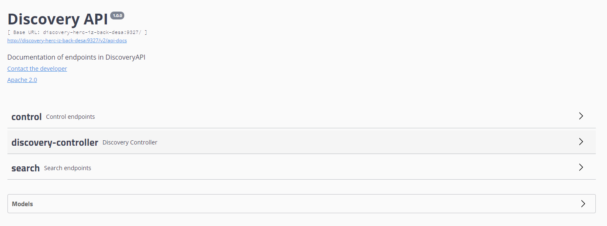
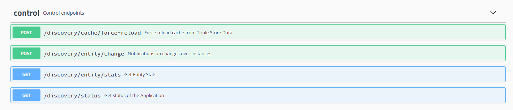
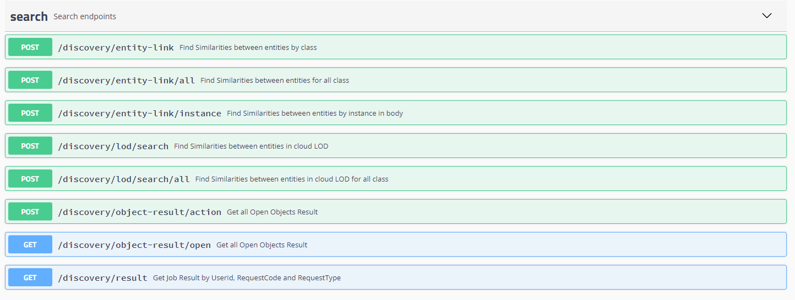

| Entregable    | Documentación de la librería de descubrimiento               |
| ------------- | ------------------------------------------------------------ |
| Fecha         | 28/04/2021                                                   |
| Revisado por  | Daniel Ruiz Santamaría                                       |
| Proyecto      | [ASIO](https://www.um.es/web/hercules/proyectos/asio) (Arquitectura Semántica e Infraestructura Ontológica) en el marco de la iniciativa [Hércules](https://www.um.es/web/hercules/) para la Semántica de Datos de Investigación de Universidades que forma parte de [CRUE-TIC](https://www.crue.org/proyecto/hercules/) |
| Módulo        | Discovery                                                    |
| Tipo          | Software                                                     |
| Objetivo      | El presente documento describe los EndPoint expuestos por la librería de descubrimiento |
| Documentación | [Librería de descubrimiento](https://github.com/HerculesCRUE/ib-asio-docs-/tree/master/24-Librer%C3%ADa_de_descubrimiento)<br/>[Manual de usuario](./manual_de_usuario.md) (documentación de alto nivel)<br />[Documentación técnica](./documentacion-tecnica.md) (documentación de bajo nivel)<br/>[README](../README.md)<br/>[docker](./docker.md)<br/>[Federación](https://github.com/HerculesCRUE/ib-discovery<br/>https://github.com/HerculesCRUE/ib-federation<br/>https://github.com/HerculesCRUE/ib-service-discovery)<br/>[Service Discovery](https://github.com/HerculesCRUE/ib-service-discovery) |

# API REST de librería de descubrimiento

La documentación de esta sección hará referencia a cada uno de los EndPoints desplegados por la librería de descubrimiento, apoyándose en la documentación proporcionada por Swagger, por lo tanto los enlaces que se facilitan para los EndPoint descritos en Swagger, solo estarán disponibles si se ha realizado el despliegue, y dicho despliegue se ha realizado en la misma máquina donde se encuentra la presente documentación. En otro caso es necesario cambiar el host y el puerto por aquellos donde la librería de URIs ha sido desplegada.

La librería de descubrimiento despliega los siguientes EndPoints:

## API REST Librería de descubrimiento

### Implementación

Es implementado por el controlador [DiscoveryController] descrito en la [seccion controladores, de la documentacion tecnica](./documentacion-tecnica.md#Controladores) 

### EndPoints

Básicamente los Endpoints están agrupados en dos grupos (según su propósito), para facilitar su identificación:



#### EndPoints de Control

Son todos aquellos Endpoints que permiten interactuar con el estado de la librería de descubrimiento



##### GET /discovery/status

Disponible en Swagger el siguiente [enlace](http://localhost:9327/swagger-ui.html#/control/statusUsingGET)

**Semántica**

- Permite obtener el estado de la aplicación

**PETICIÓN:**

```
curl -X GET "http://discovery-herc-iz-back-desa:9327/discovery/status" -H "accept: */*"
```

**RESPUESTA**

```
{
  "name": null,
  "appState": "INITIALIZED",
  "states": {
    "REDIS": {
      "state": "UPLOAD_DATA",
      "lastDate": "2020-12-13T18:58:28.437+0000"
    },
    "ELASTICSEARCH": {
      "state": "UPLOAD_DATA",
      "lastDate": "2020-12-13T18:58:28.747+0000"
    },
    "CACHE": {
      "state": "UPLOAD_DATA",
      "lastDate": "2020-12-13T18:58:28.437+0000"
    }
  },
  "lastFilterDate": {},
  "stateCode": 200
}
```

##### POST /discovery/cache/force-reload

Disponible en Swagger el siguiente [enlace](http://localhost:9327/swagger-ui.html#/discovery-controller/doForceReloadCacheUsingPOST)

**Semántica**

Permite solicitar la recarga de la cache.

**PETICIÓN:**

```
curl -X POST "http://localhost:9327/discovery/cache/force-reload" -H "accept: */*"
```

**RESPUESTA**

```
DONE
```


##### POST /discovery/entity/change

Disponible en Swagger el siguiente [enlace](http://localhost:9327/swagger-ui.html#/discovery-controller/doForceReloadCacheUsingPOST)

**Semántica**

Este es el endpoint al que se invoca cuando cambia una entidad en el Triple Store de forma que se fuerza la carga de dicha entidad, para actualizar los datos en las estructuras de datos, la cache Redis y Elasticsearch. 

Este endpoint es invocado por el servicio **event processor**, ya que es consciente de los cambios que se realizan en el triple store, por lo que es transparente para un usuario final.

**Parámetros**

- **action:** (Requerido). Cadena de Texto.  Uno de estos [INSERT,UPDATE,DELETE] que indica la acción realizada sobre el triple store.
- **node:** (Requerido). Cadena de Texto. Nodo donde se encuentra la instancia que ha sido modificada.
- **tripleStore:** (Requerido). Cadena de Texto. Triple Store donde se encuentra la instancia que ha sido modificada.
- **className:** (Requerido). Cadena de Texto.  Indica la clase a la que pertenece la instancia que ha cambiado.
- **entityLocalURI:** (Requerido). Cadena de Texto.  URI local (del Triple Store donde esta almacenada), que indica la instancia que ha sufrido alguna modificación.

**PETICIÓN:**

```
curl -X POST "http://discovery-herc-iz-back-desa:9327/discovery/entity/change?action=UPDATE&className=Person&entityLocalURI=http%3A%2F%2Flocalhost%2FPerson%2F001ab2fa-029c-364a-85e4-1f8b2644a292&node=um&tripleStore=fuseki" -H "accept: */*"
```

**RESPUESTA**

```
DONE
```

##### GET /discovery/entity/stats

Disponible en Swagger el siguiente [enlace](http://localhost:9327/swagger-ui.html#/discovery-controller/doForceReloadCacheUsingPOST)

**Semántica**

Este es el endpoint permite obtener las estadísticas de los atributos para una determinada clase pasada como parámetro. 

**Parámetros**

- **node:** (Requerido). Cadena de Texto.  Indica el nodo del que queremos obtener estadísticas.
- **tripleStore:** (Requerido). Cadena de Texto.  Indica el triple store que queremos obtener estadísticas.
- **className:** (Requerido). Cadena de Texto.  Indica la clase de la que queremos obtener estadísticas.

**PETICIÓN:**

```
curl -X GET "http://discovery-herc-iz-back-desa:9327/discovery/entity/stats?className=Person&node=um&tripleStore=fuseki" -H "accept: */*"
```

**RESPUESTA**

```
{
  "stats": {
    "maxRelativeRatio": 1,
    "instances": 9066,
    "isEmpty": false,
    "attributesSize": 5,
    "attributes": {
      "firstName": 1,
      "name": 0.97938144,
      "subjectArea": 0.013407821,
      "hasCV": 1,
      "localId": 1
    },
    "maxAttributesRelativeRatio": 1,
    "maxEntitiesRelativeRatio": 0,
    "entitiesSize": 0
  },
  "status": {
    "name": null,
    "appState": "INITIALIZED_WITH_CACHED_DATA",
    "states": {
      "REDIS": {
        "state": "CACHED_DATA",
        "lastDate": "2021-04-28T11:44:28.740+0000"
      },
      "ELASTICSEARCH": {
        "state": "NOT_INITIALIZED",
        "lastDate": null
      },
      "CACHE": {
        "state": "CACHED_DATA",
        "lastDate": "2021-04-28T11:44:28.740+0000"
      }
    },
    "lastFilterDate": {},
    "stateCode": 200
  }
}
```

###### 

#### EndPoints de Búsqueda

Son todos aquellos Endpoints que permiten realizar búsquedas de similitud usando la librería de descubrimiento.



##### POST /discovery/entity-link

Disponible en Swagger el siguiente [enlace](http://localhost:9327/swagger-ui.html#/discovery-controller/findEntityLinkByNodeTripleStoreAndClassUsingPOST)

**Semántica**

Permite realizar una **búsqueda de similitudes para todas las entidades**, dentro del propio Backend SGI, aquellas almacenadas en el mismo Triple Store, y que pertenecen a la misma clase. En caso de encontrar similitudes con suficiente grado de similitud (por encima de el umbral definido por configuración para acciones automáticas), se desencadenaran peticiones al Backend SGI, para que realice la fusión de las entidades, es decir un UPDATE con los atributos mas actualizados de ambas entidades, y un o varias operaciones DELETE, para las entidades menos actualizadas.

Para entidades almacenadas en otros Backend o Triplestores (si lo indica el parámetro linkEntities), se generaran links, entre la entidad de el propio Backend SGI, y las entidades externas de otros Backend SGIs.

**Parámetros**

- **node:** (Requerido). Cadena de Texto.  Indica el nodo (Backend SGI) a partir del cual se quiere hacer la búsqueda de similitudes.

- **tripleStore:** (Requerido). Cadena de Texto.  Indica el Triple Store a partir del cual se quiere hacer la búsqueda de similitudes.

- **className:** (Requerido). Cadena de Texto.  Indica el nombre de la clase a partir del cual se quiere hacer la búsqueda de similitudes, para esa misma clase.

- **userId:** (Requerido). Cadena de Texto.  Identificador del usuario, para auditoria, y control de Jobs.

- **requestCode:** (Requerido). Cadena de Texto.  Código de respuesta que tiene una doble función. Por un lado identifica si una misma respuesta ha sido enviada multiples veces por un cliente, y en ese caso, se todas las demás, se ignoraran. Por otro lado en caso de procesarse como una respuesta asíncrona, y de propagarse la respuesta por Kafka, esta pueda ser filtrada por el usuario (aparecerá como key en el mensaje de respuesta).

- **applyDelta:** (Opcional). Booleano. Por defecto **true** (recomendado).  Si verdadero indica que solo se quiere realizar la búsqueda, para las entidades de la clase indicada, que hayan sufrido modificaciones en el triple store, desde la última petición del mismo tipo (mismo Backend, Triple Store y clase). En caso de **false**, se realizara la búsqueda en todas las entidades.

-  **doSynchronous:** (Opcional). Booleano. Por defecto **false** (recomendado).  Si falso indica que se desea hacer la petición de forma asíncrona. De esa forma la petición se encolara en una cola FIFO, y será procesada en su turno. Dado que el tiempo necesario para el proceso, es indeterminado, y el cliente quedaría bloqueado, se recomienda hacer siempre la petición de forma asíncrona. Los resultados de la petición, se propagaran por medio de un webhook o de cola Kafka, según la preferencia del usuario. En caso de verdadero, la petición se procesara inmediatamente, y el cliente quedara a la espera de la  respuesta.

-  **propague_in_kafka:** (Opcional). Booleano. Por defecto **true** (recomendado).  Si es verdadero las acciones a llevar a cabo por el Event Proccessor se propagara en kafka en la cola, en la el topic definido en la configuración del proyecto para tal efecto (kafka.topicDiscoveryAction.topic). En caso contrario, las acciones no serán propagadas por kafka.

- **webHook:** Endpoint del cliente, para enviar callback con la respuesta, cuando esta sea procesada.

  

**PETICIÓN:**

```
curl -X POST "http://localhost:9327/discovery/entity-link?applyDelta=true&className=GrupoInvestigacion&doSynchronous=true&linkEntities=false&node=um&propague_in_kafka=true&requestCode=12345&tripleStore=trellis&userId=1" -H "accept: */*"
```

**RESPUESTA**

```
{
  "state": {
    "appState": "INITIALIZED",
    "cacheState": "UPLOAD_DATA",
    "dataState": "UPLOAD_DATA",
    "elasticState": "UPLOAD_DATA"
  },
  "response": {
    "node": "um",
    "tripleStore": "trellis",
    "className": "GrupoInvestigacion",
    "startDate": "2020-12-13 20:25:21",
    "endDate": "2020-12-13 20:25:44",
    "status": "COMPLETED",
    "results": [],
    "userId": "1",
    "requestCode": "12345"
  }
}
```

##### POST /discovery/entity-link/all

Disponible en Swagger el siguiente [enlace](http://localhost:9327/swagger-ui.html#/discovery-controller/findEntityLinkByNodeTripleStoreAndClassUsingPOST)

**Semántica**

Permite realizar una **búsqueda de similitudes para todas las entidades**, dentro del propio Backend SGI, aquellas almacenadas en el mismo Triple Store, y a diferencia de el endpoint anterior, para **todas las clases**. 

Esto permite que la llamada al endpoint sea invocada solo una vez desde una tarea programada en cron, y busque similitudes para todas las clases. 

En caso de encontrar similitudes con suficiente grado de similitud (por encima de el umbral definido por configuración para acciones automáticas), se desencadenaran peticiones al Backend SGI, para que realice la fusión de las entidades, es decir un UPDATE con los atributos mas actualizados de ambas entidades, y un o varias operaciones DELETE, para las entidades menos actualizadas.

Para entidades almacenadas en otros Backend o Triplestores (si lo indica el parámetro linkEntities), se generaran links, entre la entidad de el propio Backend SGI, y las entidades externas de otros Backend SGIs.

**Parámetros**

- **node:** (Requerido). Cadena de Texto.  Indica el nodo (Backend SGI) a partir del cual se quiere hacer la búsqueda de similitudes.

- **tripleStore:** (Requerido). Cadena de Texto.  Indica el Triple Store a partir del cual se quiere hacer la búsqueda de similitudes.

- **userId:** (Requerido). Cadena de Texto.  Identificador del usuario, para auditoria, y control de Jobs.

- **requestCode:** (Requerido). Cadena de Texto.  Código de respuesta que tiene una doble función. Por un lado identifica si una misma respuesta ha sido enviada multiples veces por un cliente, y en ese caso, se todas las demás, se ignoraran. Por otro lado en caso de procesarse como una respuesta asíncrona, y de propagarse la respuesta por Kafka, esta pueda ser filtrada por el usuario (aparecerá como key en el mensaje de respuesta).

- **applyDelta:** (Opcional). Booleano. Por defecto **true** (recomendado).  Si verdadero indica que solo se quiere realizar la búsqueda, para las entidades de la clase indicada, que hayan sufrido modificaciones en el triple store, desde la última petición del mismo tipo (mismo Backend, Triple Store y clase). En caso de **false**, se realizara la búsqueda en todas las entidades.

- **doSynchronous:** (Opcional). Booleano. Por defecto **false** (recomendado).  Si falso indica que se desea hacer la petición de forma asíncrona. De esa forma la petición se encolara en una cola FIFO, y será procesada en su turno. Dado que el tiempo necesario para el proceso, es indeterminado, y el cliente quedaría bloqueado, se recomienda hacer siempre la petición de forma asíncrona. Los resultados de la petición, se propagaran por medio de un webhook o de cola Kafka, según la preferencia del usuario. En caso de verdadero, la petición se procesara inmediatamente, y el cliente quedara a la espera de la  respuesta.

- **propague_in_kafka:** (Opcional). Booleano. Por defecto **true** (recomendado).  Si es verdadero las acciones a llevar a cabo por el Event Proccessor se propagara en kafka en la cola, en la el topic definido en la configuración del proyecto para tal efecto (kafka.topicDiscoveryAction.topic). En caso contrario, las acciones no serán propagadas por kafka.

- **webHook:** Endpoint del cliente, para enviar callback con la respuesta, cuando esta sea procesada.

  

**PETICIÓN:**

```
curl -X POST "http://localhost:9327/discovery/entity-link?applyDelta=true&className=GrupoInvestigacion&doSynchronous=true&linkEntities=false&node=um&propague_in_kafka=true&requestCode=12345&tripleStore=trellis&userId=1" -H "accept: */*"
```

**RESPUESTA**

```
{
  "state": {
    "appState": "INITIALIZED",
    "cacheState": "UPLOAD_DATA",
    "dataState": "UPLOAD_DATA",
    "elasticState": "UPLOAD_DATA"
  },
  "response": {
    "node": "um",
    "tripleStore": "trellis",
    "className": "GrupoInvestigacion",
    "startDate": "2020-12-13 20:25:21",
    "endDate": "2020-12-13 20:25:44",
    "status": "COMPLETED",
    "results": [],
    "userId": "1",
    "requestCode": "12345"
  }
}
```

##### POST /discovery/entity-link/instance

Disponible en Swagger el siguiente [enlace](http://localhost:9327/swagger-ui.html#/discovery-controller/findEntityLinkByEntityAndNodeTripleStoreAndClassUsingPOST)

**Semántica**

Permite realizar una búsqueda de similitudes entre la entidad enviada en el Body, y el resto de entidades dentro del propio Backend SGI, aquellas almacenadas en el mismo Triple Store, y que pertenecen a la misma clase. En caso de encontrar similitudes con suficiente grado de similitud (por encima de el umbral definido por configuración para acciones automáticas), se desencadenaran peticiones al Backend SGI, para que realice la fusión de las entidades, es decir un UPDATE con los atributos mas actualizados de ambas entidades, y un o varias operaciones DELETE, para las entidades menos actualizadas.

Para entidades almacenadas en otros Backend o Triplestores (si lo indica el parámetro linkEntities), se generaran links, entre la entidad de el propio Backend SGI, y las entidades externas de otros Backend SGIs.

Es especialmente útil para evitar insertar duplicados, si estos ya existen en el Triple Store, por ejemplo en el caso de la Factoría de URIs, que se integra con la librería de descubrimiento de modo que , mediante una llamada a este método, puede saber si la entidad ya existe, y en caso afirmativo, retorna la URI del objeto equivalente encontrado, en vez de generar una nueva, y por lo tanto, evitar asi generar un duplicado.

**Parámetros**

- **node:** (Requerido). Cadena de Texto.  Indica el nodo (Backend SGI) a partir del cual se quiere hacer la búsqueda de similitudes.
- **tripleStore:** (Requerido). Cadena de Texto.  Indica el Triple Store a partir del cual se quiere hacer la búsqueda de similitudes.
- **className:** (Requerido). Cadena de Texto.  Indica el nombre de la clase a partir del cual se quiere hacer la búsqueda de similitudes, para esa misma clase.
- **userId:** (Requerido). Cadena de Texto.  Identificador del usuario, para auditoria, y control de Jobs.
- **requestCode:** (Requerido). Cadena de Texto.  Código de respuesta que tiene una doble función. Por un lado identifica si una misma respuesta ha sido enviada multiples veces por un cliente, y en ese caso, se todas las demás, se ignoraran. Por otro lado en caso de procesarse como una respuesta asíncrona, y de propagarse la respuesta por Kafka, esta pueda ser filtrada por el usuario (aparecerá como key en el mensaje de respuesta).
- **applyDelta:** (Opcional). Booleano. Por defecto **true** (recomendado).  Si verdadero indica que solo se quiere realizar la búsqueda, para las entidades de la clase indicada, que hayan sufrido modificaciones en el triple store, desde la última petición del mismo tipo (mismo Backend, Triple Store y clase). En caso de **false**, se realizara la búsqueda en todas las entidades.
-  **doSynchronous:** (Opcional). Booleano. Por defecto **false** (recomendado).  Si falso indica que se desea hacer la petición de forma asíncrona. De esa forma la petición se encolara en una cola FIFO, y será procesada en su turno. Dado que el tiempo necesario para el proceso, es indeterminado, y el cliente quedaría bloqueado, se recomienda hacer siempre la petición de forma asíncrona. Los resultados de la petición, se propagaran por medio de un webhook o de cola Kafka, según la preferencia del usuario. En caso de verdadero, la petición se procesara inmediatamente, y el cliente quedara a la espera de la  respuesta.
-  **propague_in_kafka:** (Opcional). Booleano. Por defecto **true** (recomendado).  Si es verdadero las acciones a llevar a cabo por el Event Proccessor se propagara en kafka en la cola, en la el topic definido en la configuración del proyecto para tal efecto (kafka.topicDiscoveryAction.topic). En caso contrario, las acciones no serán propagadas por kafka.
- **webHook:** Endpoint del cliente, para enviar callback con la respuesta, cuando esta sea procesada.

**Body**: El objeto con el cual se quiere comparar si existe o no en el Triple Store

```
{
	"description": "PEDIATRÍA"
}
```


**PETICIÓN:**

```
curl -X POST "http://localhost:9327/discovery/entity-link/instance?className=GrupoInvestigacion&doSynchronous=true&entityId=12345678890&linkEntities=false&node=um&propague_in_kafka=true&requestCode=12345&tripleStore=trellis&userId=1" -H "accept: */*" -H "Content-Type: application/json" -d "{ \"description\" : \"PEDIATRÍA\"}"
```

**RESPUESTA**

```
{
  "state": {
    "appState": "INITIALIZED",
    "cacheState": "UPLOAD_DATA",
    "dataState": "UPLOAD_DATA",
    "elasticState": "UPLOAD_DATA"
  },
  "response": {
    "node": "um",
    "tripleStore": "trellis",
    "className": "GrupoInvestigacion",
    "startDate": "2020-12-13 20:25:21",
    "endDate": "2020-12-13 20:25:44",
    "status": "COMPLETED",
    "results": [],
    "userId": "1",
    "requestCode": "12345"
  }
}
```

##### POST /discovery/lod/search

Disponible en Swagger el siguiente [enlace](http://localhost:9327/swagger-ui.html#/discovery-controller/findEntityLinkByEntityAndNodeTripleStoreAndClassUsingPOST)

**Semántica**

Permite realizar una búsqueda de similitudes entre las instancias de una determinada clase almacenada en un determinado nodo y triple store, con las instancias de los distintos datasets de la nube LOD configurados para el proyecto.

Por otro lado gestiona también la inserción de los objetos similares encontrados en otros dataset en un name graph especifico dentro de nuestro triple store y añade las tripletas de relación **skos:closeMatch**, para declarar la semejanza entre ambos objetos.

**Parámetros**

* **dataSource:** (Requerido). Cadena de Texto.  Cadena de texto para expresar los datasets (separados por comas) donde queremos realizar la búsqueda de objetos similares. Por defecto el carácter * representa un wildcard para indicar todos los dataset configurados.

- **node:** (Requerido). Cadena de Texto.  Indica el nodo (Backend SGI) a partir del cual se quiere hacer la búsqueda de similitudes.
- **tripleStore:** (Requerido). Cadena de Texto.  Indica el Triple Store a partir del cual se quiere hacer la búsqueda de similitudes.
- **className:** (Requerido). Cadena de Texto.  Indica el nombre de la clase a partir del cual se quiere hacer la búsqueda de similitudes, para esa misma clase.
- **userId:** (Requerido). Cadena de Texto.  Identificador del usuario, para auditoria, y control de Jobs.
- **requestCode:** (Requerido). Cadena de Texto.  Código de respuesta que tiene una doble función. Por un lado identifica si una misma respuesta ha sido enviada multiples veces por un cliente, y en ese caso, se todas las demás, se ignoraran. Por otro lado en caso de procesarse como una respuesta asíncrona, y de propagarse la respuesta por Kafka, esta pueda ser filtrada por el usuario (aparecerá como key en el mensaje de respuesta).
- **applyDelta:** (Opcional). Booleano. Por defecto **true** (recomendado).  Si verdadero indica que solo se quiere realizar la búsqueda, para las entidades de la clase indicada, que hayan sufrido modificaciones en el triple store, desde la última petición del mismo tipo (mismo Backend, Triple Store y clase). En caso de **false**, se realizara la búsqueda en todas las entidades.
- **doSynchronous:** (Opcional). Booleano. Por defecto **false** (recomendado).  Si falso indica que se desea hacer la petición de forma asíncrona. De esa forma la petición se encolara en una cola FIFO, y será procesada en su turno. Dado que el tiempo necesario para el proceso, es indeterminado, y el cliente quedaría bloqueado, se recomienda hacer siempre la petición de forma asíncrona. Los resultados de la petición, se propagaran por medio de un webhook o de cola Kafka, según la preferencia del usuario. En caso de verdadero, la petición se procesara inmediatamente, y el cliente quedara a la espera de la  respuesta.
- **propague_in_kafka:** (Opcional). Booleano. Por defecto **true** (recomendado).  Si es verdadero las acciones a llevar a cabo por el Event Proccessor se propagara en kafka en la cola, en la el topic definido en la configuración del proyecto para tal efecto (kafka.topicDiscoveryAction.topic). En caso contrario, las acciones no serán propagadas por kafka.
- **webHook:** Endpoint del cliente, para enviar callback con la respuesta, cuando esta sea procesada.

**Body**: El objeto con el cual se quiere comparar si existe o no en el Triple Store

```
{
	"description": "PEDIATRÍA"
}
```


**PETICIÓN:**

```
curl -X POST "http://discovery-herc-iz-back-desa:9327/discovery/lod/search?applyDelta=true&className=Book&dataSource=*&doSynchronous=false&node=um&propague_in_kafka=true&requestCode=123454321&tripleStore=fuseki&userId=1" -H "accept: */*"
```

**RESPUESTA**

```
{
  "state": {
    "appState": "INITIALIZED_WITH_CACHED_DATA",
    "cacheState": "CACHED_DATA",
    "dataState": "CACHED_DATA",
    "elasticState": "NOT_INITIALIZED"
  },
  "response": {
    "node": "um",
    "tripleStore": "fuseki",
    "className": "Book",
    "startDate": null,
    "endDate": null,
    "status": "PENDING",
    "results": [],
    "userId": "1",
    "requestCode": "123454321",
    "requestType": "LOD_SEARCH"
  }
}
```

##### POST /discovery/lod/search/all

Disponible en Swagger el siguiente [enlace](http://localhost:9327/swagger-ui.html#/discovery-controller/findEntityLinkByEntityAndNodeTripleStoreAndClassUsingPOST)

**Semántica**

Permite realizar una búsqueda de similitudes entre las instancias **de todas las clases** , **en todos los datasets** almacenada en un determinado nodo y triple store, con las instancias de los distintos datasets de la nube LOD configurados para el proyecto.

Esto permite que la llamada al endpoint sea invocada solo una vez desde una tarea programada en cron, y busque similitudes para todas las clases. 

Por otro lado gestiona también la inserción de los objetos similares encontrados en otros dataset en un name graph especifico dentro de nuestro triple store y añade las tripletas de relación **skos:closeMatch**, para declarar la semejanza entre ambos objetos.

**Parámetros**

- **tripleStore:** (Requerido). Cadena de Texto.  Indica el Triple Store a partir del cual se quiere hacer la búsqueda de similitudes.
- **userId:** (Requerido). Cadena de Texto.  Identificador del usuario, para auditoria, y control de Jobs.
- **requestCode:** (Requerido). Cadena de Texto.  Código de respuesta que tiene una doble función. Por un lado identifica si una misma respuesta ha sido enviada multiples veces por un cliente, y en ese caso, se todas las demás, se ignoraran. Por otro lado en caso de procesarse como una respuesta asíncrona, y de propagarse la respuesta por Kafka, esta pueda ser filtrada por el usuario (aparecerá como key en el mensaje de respuesta).
- **applyDelta:** (Opcional). Booleano. Por defecto **true** (recomendado).  Si verdadero indica que solo se quiere realizar la búsqueda, para las entidades de la clase indicada, que hayan sufrido modificaciones en el triple store, desde la última petición del mismo tipo (mismo Backend, Triple Store y clase). En caso de **false**, se realizara la búsqueda en todas las entidades.
- **propague_in_kafka:** (Opcional). Booleano. Por defecto **true** (recomendado).  Si es verdadero las acciones a llevar a cabo por el Event Proccessor se propagara en kafka en la cola, en la el topic definido en la configuración del proyecto para tal efecto (kafka.topicDiscoveryAction.topic). En caso contrario, las acciones no serán propagadas por kafka.
- **webHook:** Endpoint del cliente, para enviar callback con la respuesta, cuando esta sea procesada.

**Body**: El objeto con el cual se quiere comparar si existe o no en el Triple Store

```
{
	"description": "PEDIATRÍA"
}
```


**PETICIÓN:**

```
curl -X POST "http://discovery-herc-iz-back-desa:9327/discovery/lod/search/all?applyDelta=true&propague_in_kafka=true&requestCode=123454321&tripleStore=fuseki&userId=1" -H "accept: */*"
```

**RESPUESTA**

```
{
  "state": {
    "appState": "INITIALIZED_WITH_CACHED_DATA",
    "cacheState": "CACHED_DATA",
    "dataState": "CACHED_DATA",
    "elasticState": "NOT_INITIALIZED"
  },
  "response": {
    "node": "um",
    "tripleStore": "fuseki",
    "className": "Book",
    "startDate": null,
    "endDate": null,
    "status": "PENDING",
    "results": [],
    "userId": "1",
    "requestCode": "123454321",
    "requestType": "LOD_SEARCH"
  }
}
```

##### GET /discovery/result

Disponible en Swagger el siguiente [enlace](http://localhost:9327/swagger-ui.html#/discovery-controller/findEntityLinkByEntityAndNodeTripleStoreAndClassUsingPOST)

**Semántica**

Permite obtener el resultado de una operación de búsqueda de similitud anterior por medio de el tipo de petición, el codigo de petición y el Id del Usuario.

Esta especialmente diseñado para recuperar respuestas de peticiones asíncronas anteriores.

**Parámetros**

- **requestType:** (Requerido). Cadena de Texto. Enumerado  entre ENTITY_LINK_CLASS (para búsquedas de una determinada clase), ENTITY_LINK_INSTANCE (para búsquedas a partir de una instancia) y , LOD SEARCH (para búsquedas  en la nube LOD).
- **requestCode:** (Requerido). Cadena de Texto. Código de la petición de la cual se quiere obtener la respuesta.
- **userId:** (Requerido). Cadena de Texto. Código del usuario para el cual se quiere obtener una respuesta.

**PETICIÓN:**

```
curl -X GET "http://discovery-herc-iz-back-desa:9327/discovery/result?requestCode=12345&requestType=ENTITY_LINK_CLASS&userId=1" -H "accept: */*"
```

**RESPUESTA**

```
{
  "response": {
    "userId": "1",
    "requestCode": "12345",
    "requestType": "ENTITY_LINK_CLASS",
    "status": "not found"
  }
}
```


##### GET /discovery/object-result/open

Disponible en Swagger el siguiente [enlace](http://localhost:9327/swagger-ui.html#/discovery-controller/findEntityLinkByEntityAndNodeTripleStoreAndClassUsingPOST)

**Semántica**

Permite obtener todos los resultados anteriores que aun están abiertos, es decir para los cuales no se ha implementado ninguna acción (similitudes manuales), y aun no han sido ni aceptadas ni desechadas.

**Parámetros**

- **node:** (Requerido). Cadena de Texto.  Indica el nodo donde se quieren buscar las similitudes abiertas.
- **tripleStore** (Requerido). Cadena de Texto.  indica el triple store donde se quieren buscar las similitudes abiertas.

**PETICIÓN:**

```
curl -X GET "http://discovery-herc-iz-back-desa:9327/discovery/object-result/open?node=um&tripleStore=fuseki" -H "accept: */*"
```

**RESPUESTA**

```
{
  "state": {
    "appState": "INITIALIZED_WITH_CACHED_DATA",
    "cacheState": "CACHED_DATA",
    "dataState": "CACHED_DATA",
    "elasticState": "UPLOAD_DATA"
  },
  "response": {
    "node": "um",
    "tripleStore": "fuseki",
    "className": "Book",
    "startDate": "2021-04-22 21:40:47",
    "endDate": "2021-04-22 21:44:42",
    "status": "COMPLETED",
    "results": [
      
    ]
  }
}
```

##### POST /discovery/object-result/action

Disponible en Swagger el siguiente [enlace](http://localhost:9327/swagger-ui.html#/discovery-controller/findEntityLinkByEntityAndNodeTripleStoreAndClassUsingPOST)

**Semántica**

Permite establecer una decisión (entre aceptada o descartada) sobre las similitudes manuales que aun continúan abiertas.

**Parámetros**

- **className:** (Requerido). Cadena de Texto.  Indica la clase a la que pertenece los objetos sobre los cuales se quiere aplicar una decisión.
- **decision**: (Requerido). Enumerado entre ACCEPTED o DISCARDED. Indica si la propuesta de acción se acepta o descarta para la similitud manual.
- **entityIdMainObject: **(Requerido). Id del objeto que actuara como objeto base de la similitud y por lo tanto conservara todos sus atributos no nulos en la operación MERGE.
- **entityIdRelatedObject: **(Requerido). Id del objeto relacionado, que será eliminado tras conservar alguno de sus atributos (los que sean nulos en el objeto principal y no nulos en el relacionado). 

**PETICIÓN:**

```
curl -X POST "http://discovery-herc-iz-back-desa:9327/discovery/object-result/action?className=Book&decision=ACCEPTED&entityIdMainObject=adda&entityIdRelatedObject=dasda" -H "accept: */*"
```

**RESPUESTA**

```
{
  "state": {
    "appState": "INITIALIZED_WITH_CACHED_DATA",
    "cacheState": "CACHED_DATA",
    "dataState": "CACHED_DATA",
    "elasticState": "UPLOAD_DATA"
  },
  "response": {
    "node": "um",
    "tripleStore": "fuseki",
    "className": "Book",
    "startDate": "2021-04-22 21:40:47",
    "endDate": "2021-04-22 21:44:42",
    "status": "COMPLETED",
    "results": [
      
    ]
  }
}
```

