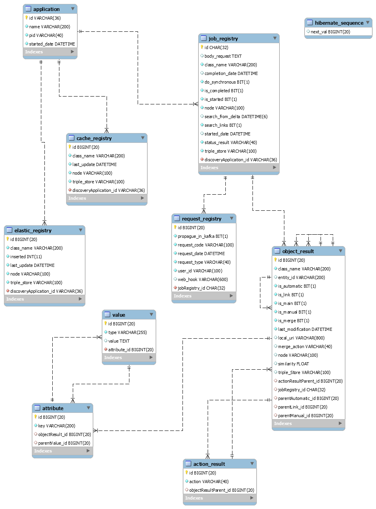

| Entregable     | Librería de descubrimiento                                   |
| -------------- | ------------------------------------------------------------ |
| Fecha          | 28/04/2021                                                   |
| Revisado por   | Paloma Terán Pérez                                           |
| Proyecto       | [ASIO](https://www.um.es/web/hercules/proyectos/asio) (Arquitectura Semántica e Infraestructura Ontológica) en el marco de la iniciativa [Hércules](https://www.um.es/web/hercules/) para la Semántica de Datos de Investigación de Universidades que forma parte de [CRUE-TIC](https://www.crue.org/proyecto/hercules/) |
| Módulo         | Arquitectura Semántica                                       |
| Tipo           | Documentación                                                |
| Objetivo       | El presente documento pretende ser la documentación técnica relativa a el entregable librería de descubrimiento. Para ello, se documentaran exhaustivamente tanto los aspectos relativos a su despliegue, como todos los End Point que esta ofrece a otros procesos o usuarios, para interactuar con la misma. |
| Estado         | Todas los objetivos (excepto el de búsqueda de instancias relacionadas en la nube LOD), enumeradas en el punto anterior, están implementadas al **100%**. Dado que para implementar el objetivo restante, se reutilizara la mayor parte de la algoritmia implementada, las partes necesarias a desarrollar se concentraran básicamente en los conectores y mapeos descritos en el documento por lo que se estima que el nivel de completitud de la librería seria aproximadamente de un **75%** |
| Próximos pasos | La integración con componentes desarrollados en una fase de madurez no final, o otros por desarrollar (tales como la gestión de eventos de acciones propagados por la librería o la parte del frontal web que permita aceptar o desechar sugerencias de similitud por parte de usuarios finales), quizás requieran la modificación o creación de algún EndPoint adicional, aunque según lo descrito en el apartado anterior, la implementación de estos desde el punto de vista de la librería debería de ser trivial. |
| Documentación  | [Librería de descubrimiento](https://github.com/HerculesCRUE/ib-asio-docs-/blob/master/24-Librer%C3%ADa_de_descubrimiento/ASIO_Libreria_de_descubrimiento.md) [Manual de usuario](./manual_de_usuario.md) (documentación de alto nivel) [Documentación técnica](./documentacion-tecnica.md) (documentación de bajo nivel) [Documentación API REST de la librería de descubrimiento](./documentacion_api_rest_de_la_libreria_de_descubrimiento.md) (documentación de bajo nivel) [README](../README.md) [docker](./docker.md) [Federación](https://github.com/HerculesCRUE/ib-discovery https://github.com/HerculesCRUE/ib-federation https://github.com/HerculesCRUE/ib-service-discovery) [Service Discovery](https://github.com/HerculesCRUE/ib-service-discovery) |

# Manual de usuario

El presente documento realiza una descripción de la librería de descubrimiento a alto nivel, por lo tanto, se complementa con el documento de [Documentación técnica](./documentacion-tecnica.md) que la describe a bajo nivel.

Únicamente pretende mejorar la comprensión del usuario, de las funcionalidades implementadas y el cumplimiento de lo expresado en el documento    [Librería de descubrimiento](https://github.com/HerculesCRUE/ib-asio-docs-/blob/master/24-Librer%C3%ADa_de_descubrimiento/ASIO_Libreria_de_descubrimiento.md) que expresa los requerimientos del proyecto y algoritmos desarrollados desde un punto de vista conceptal. 

## Despliegue

Se puede encontrar documentación exhaustiva de desplieguen en el documento [build](./build.md) tanto para usuarios finales como para desarrolladores.

## Entorno

La librería de descubrimiento, necesita las siguientes herramientas:

* Redis
* Elasticsearch
* MariaDB
* Kafka
* Zookeeper

Se puede encontrar información sobre el despliegue del entorno el el documento [build.md (seccion Despliegue del entorno)](https://github.com/HerculesCRUE/ib-discovery/blob/master/docs/build.md#Despliegue-del-entorno)

## Estructuras de datos

La librería de descubrimiento se apoya, según la funcionalidad, en diversas estructuras de datos, según lo expresado en la [Documentación técnica](./documentacion-tecnica.md).

Todas las conversiones entre los distintos modelos de datos aquí nombrados, son posibles, y están implementadas en la librería.

Entre ellas cae destacar:

* [Modelo de datos general (en memoría)](https://github.com/HerculesCRUE/ib-discovery/blob/master/docs/documentacion-tecnica.md#Modelo-de-datos-General): Este es el modelo general usado por la librería de descubrimiento. Tiene la flexibilidad de modelar cualquier entidad con cualquier tipo de complejidad.
* [Modelo de datos Elasticsearch](https://github.com/HerculesCRUE/ib-discovery/blob/master/docs/documentacion-tecnica.md#Modelo-de-datos-Elasticsearch): Este es el modelo de datos usado para modelar las entidades almacenadas en Elasticsearch. Básicamente es el mimo modelo que el general, con algunos atributos específicos, optimizados para Elasticsearch.
* [Estructuras de datos en memoria](https://github.com/HerculesCRUE/ib-discovery/blob/master/docs/documentacion-tecnica.md#Estructuras-de-datos-en-memoria): Son la estructuras que almacenan el modelo de datos general. Están optimizadas para realizar cualquier búsqueda con una complejidad de O(1)
* [Estructuras de en REDIS](https://github.com/HerculesCRUE/ib-discovery/blob/master/docs/documentacion-tecnica.md#Estructuras-de-datos-en-REDIS): Son la estructuras de datos soportadas por REDIS, que actúa de cache.
* [Estructuras de datos del modelo relacional](https://github.com/HerculesCRUE/ib-discovery/blob/master/docs/documentacion-tecnica.md#Estructuras-de-datos-del-modelo-Relacional): Son la estructuras de datos para el modelo relacional.

## Búsqueda de similitudes

### Tipos de petición

La librería de descubrimiento, para búsqueda de similitudes ofrece la posibilidad de realizar dos tipos de peticiones:

#### Peticiones síncronas (no recomendada)

Se procesan inmediatamente. 

El cliente quedara esperando la respuesta hasta que la petición haya concluido con un resultado. 

Dado que el tiempo necesario para procesar la solicitud depende del número de instancias que contiene la clase a evaluar, el tiempo de respuesta potencialmente puede ser largo. Este es el motivo por el que este tipo de peticiones esta desaconsejado.   

#### Peticiones asíncronas (recomendada)

Se encolan en una cola FIFO. 

El endpoint responde inmediatamente, indicando el estado de la petición, que será siempre pendiente hasta que se procese.

Otro aspecto interesante de este tipo de operaciones, es que si se realizan varias peticiones del mismo tipo, solo se procesara una vez, pero sin embargo se dará respuesta a todos los usuarios que realizaron la petición.

La respuesta será ofrecida al usuario por medio de alguno de los métodos de respuesta asíncrono comentado a continuación. 

### Respuestas

#### Respuestas asíncronas

Cuando el usuario realiza una petición asíncrona, la respuesta recibida será también enviada por un método asíncrono, entre ellos:  

* **Webhook:** End point disponible por el cliente donde el servidor enviara la respuesta.

* **Cola Kafka:** Cola Kafka donde el servidor enviara la respuesta.

#### Estructura de respuesta

La respuesta ya sea síncrona o asíncrona tiene la siguiente estructura

*  Estado de la aplicación: Es esta sección se puede ver el estado de la aplicación de forma que se puede inferir si los resultados han sido generados a partir de datos cacheados o no.
* Similitudes: En esta sección se muestran las similitudes encontradas con la siguiente estructura:
  * Objeto principal a partir del cual se han encontrado similitudes con otros objetos
  * Similitudes automáticas: Lista de Objetos que tienen un grado suficiente de similitud con el objeto principal (configurado a partir de un umbral configurable) para poder desencadenar acciones automáticas.
  *  Similitudes manuales: Lista de Objetos que tienen un grado con un grado de similitud con el objeto principal (configurado a partir de un umbral configurable) que requiere una supervisión por algún usuario.
  * Links: Enlaces encontrados a partir del objeto principal, con otras Backend o/y Triple Stores, que desencadenaran acciones de añadir enlaces.
  * Acciones: Lista de acciones desencadenadas a partir de las similitudes automáticas o links, para realizar las acciones oportunas en el triple store, para eliminar duplicados o reflejar enlaces, entre ellas:
    * UPDATE: acciones de actualización que se dan en dos casos:
      * Cuando se encuentra una similitud automática entre dos entidades, se generara un merge entre ambas. Tomando como referencia el objeto mas reciente, se actualizara este con los datos que pudiesen estar presentes en el objeto mas antiguo, y no en el actual. El resultado se ejecutara como un UPDATE sobre el objeto mas reciente.
      * Cuando se encuentran similitudes entre objetos de distintos Backends o Triple Stores, hay que actualizar ambos objetos, añadiéndoles a ambos tripletas de relección (owl: sameAs) hacia el otro objeto encontrado.
    * DELETE: En el caso de las similitudes automáticas, y una vez completado el proceso de merge, se eliminara el objeto más antiguo (Borrado lógico, ver [Memento](https://github.com/HerculesCRUE/ib-asio-docs-/blob/master/00-Arquitectura/arquitectura_semantica/ldp/Requisitos%20LDP%20Server/Memento%20Gu%C3%ADa%20y%20Normativa.md)).

### Propagación de acciones

#### Automáticas

Las acciones se propagaran siempre por publicaciones en cola Kafka, de forma que estas puedan ser procesadas de forma asíncrona por el Event Proccesor.

#### Similitudes manuales

Estas estarán disponibles en una pantalla creada para tal efecto en el Frontal de la aplicación ASIO, de forma que puedan se consultadas por un usuario autorizado.

Si el usuario, confirmase las similitudes, estas serian procesadas de la misma forma que se ha descrito para las acciones automáticas, en caso de ser desechadas, se notificara a la librería de descubrimiento para que no presente en el futuro, dichas similitudes.

### Búsqueda de similitudes por clases

La librería de descubrimiento ofrece la posibilidad de buscar similitudes entre todas las instancias de una misma clase, es decir cada instancia de esa clase se comparará con todas las demás.

Esto es especialmente útil para detectar y eliminar duplicados que puedan estar almacenados en el triple store.

El endpoint que facilita esta funcionalidad esta ampliamente documentado en [Documentación API REST de la librería de descubrimiento (POST /discovery/entity-link)](https://github.com/HerculesCRUE/ib-discovery/blob/master/docs/documentacion_api_rest_de_la_libreria_de_descubrimiento.md#post-discoveryentity-link)

Para todas las similitudes encontradas se generaran las acciones oportunas que serán procesadas, tal y como se establece en la sección 

### Búsqueda de similitudes por instancias

La librería de descubrimiento ofrece la posibilidad de buscar similitudes con una determinada instancia pasada por parámetro, con todas las demas instancias de su clase.

Esto es especialmente útil para impedir que se generen nuevos duplicados en el triple store, por lo tanto este endpoint trabajara en conjunto con la [Factoria de URIs](https://github.com/HerculesCRUE/ib-asio-docs-/tree/master/10-Librer%C3%ADa_Factor%C3%ADa_de_URIs). En este caso la factoría de URIs, para cada nueva URI que sea requerida, realizara una petición a la librería de descubrimiento. En caso de que la librería de descubrimiento detecte que el objeto ya existe en el triple store, se retornara la URI del objeto existente, en otro caso, se retornara una URI nueva. 

El endpoint que facilita esta funcionalidad esta ampliamente documentado en [Documentación API REST de la librería de descubrimiento (POST /discovery/entity-link/instance)](https://github.com/HerculesCRUE/ib-discovery/blob/master/docs/documentacion_api_rest_de_la_libreria_de_descubrimiento.md#post-discoveryentity-linkinstance)

## Modelo de datos

Es conveniente para mejorar la comprensión, conocer el modelo de datos, que soporta la funcionalidad de la librería de URIs.

### 

## API REST de Factoría de URIS

El API Rest en su totalidad se encuentra documentado, mediante Swagger.

Swagger se desplegara de forma automática,  al ejecutar el proyecto, en el mismo host y el mismo puerto configurado en el application.yml.

Por lo tanto se podrá acceder a Swagger mediante una URL de es siguiente formato:  

[http://{HOST_FACTORIA_URIS}:[SWAGGER_PORT]/swagger-ui.html](http://localhost:9326/swagger-ui.html)

En caso de ejecutar en la maquina local, con la configuración presente actualmente en el fichero application.yml, la URI resultante será

http://localhost:9327/swagger-ui.html

Obteniendo el siguiente resultado

Por otro lado, puede encontrarse una documentación exhaustiva de los Endpoint desplegados por el API, en el documento [Librería de descubrimiento](https://github.com/HerculesCRUE/ib-asio-docs-/blob/master/24-Librer%C3%ADa_de_descubrimiento/ASIO_Libreria_de_descubrimiento.md)

[#Automáticas]: 